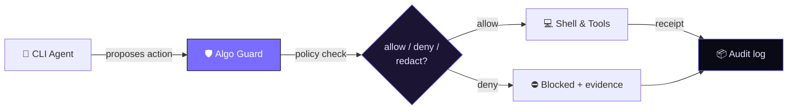

  

  

  <strong>Policy-enforced guard between CLI agents and the shell.</strong> 
  🏛️ An official organization of <a href="https://github.com/algorithco"><strong>Algorithco</strong></a> — builders of future technology.

  
  
  

  
  
  

---

## 🚀 Flagship

  

> **Algo** puts contracts and evidence between the agent and the machine: every action is
> typed, policy-checked, and reversible — Phase 0 ships the proto contracts plus the eval
> harness that gates every threshold change.

  
  &nbsp;
  
  &nbsp;
  

## 🧭 How it works

## 🛠️ Built with

  

## 📐 Principles

| Principle | What it means in practice |
|-----------|---------------------------|
| 🔐 **Secure by default** | Least privilege, secret scanning, reproducible builds — inherited, not bolted on |
| 📈 **Reliable in production** | Health checks, observability, and failure-mode thinking in every template |
| 🧩 **Consistent at scale** | One source of truth for policies, workflows, and community health files |

## 🛡️ Official organizations

| | Organization | Role |
|---|---|---|
| 🏢 | [**@algorithco**](https://github.com/algorithco) | Owner — products, platform, partnerships |
| 🛡️ | [**@algorithco-cli**](https://github.com/algorithco-cli) | This org — CLI guard, policies, tooling |

Only these two are official. Anything else claiming to be Algorithco is not affiliated.

<strong>How to verify you're in the right place</strong>

 

1. The URL is exactly `github.com/algorithco-cli`
2. The avatar matches the purple `>:` logo on `#0A0A14` (see [`profile/logo.svg`](./logo.svg))
3. It's cross-linked from the main [`algorithco`](https://github.com/algorithco) org

---

  © 2026 Algorithco · Uzbekistan · Working worldwide · <a href="https://github.com/algorithco">algorithco</a> · <a href="https://github.com/algorithco-cli">algorithco-cli</a>

